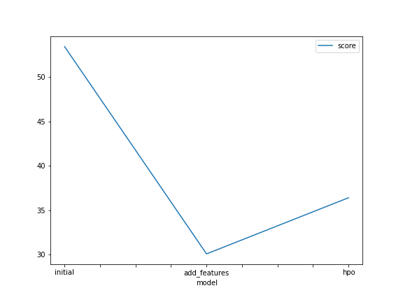
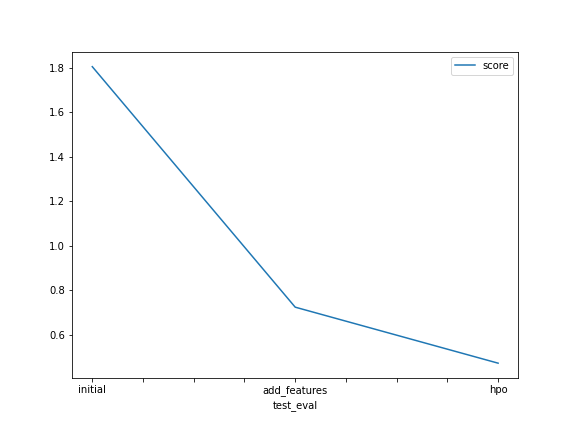

# Report: Predict Bike Sharing Demand with AutoGluon Solution
#### NAME HERE

## Initial Training
### What did you realize when you tried to submit your predictions? What changes were needed to the output of the predictor to submit your results?
First time I tried without removing the classic and register features after fixing this error I found that the intial trainig not giving enough output so I had to replace the -ve values with zeros

### What was the top ranked model that performed?
WeightedEnsemble_L3

## Exploratory data analysis and feature creation
### What did the exploratory analysis find and how did you add additional features?
divide datetime to month, year, day and hour. Moerover, transform the season and weather features to categorical

### How much better did your model preform after adding additional features and why do you think that is?
Adding one more depandable feature was usuful as it halped my modal to detect the pattern of seasonality in my data

## Hyper parameter tuning
### How much better did your model preform after trying different hyper parameters?
It effected my score badly

### If you were given more time with this dataset, where do you think you would spend more time?
PCA 

### Create a table with the models you ran, the hyperparameters modified, and the kaggle score.
|model|hpo1|hpo2|hpo3|score|
|--|--|--|--|--|
|initial|default_values|default_values|default_values|1.80484|
|add_features|default_values|default_values|default_values|0.72414|
|hpo|GBM: num_leaves: lower=26, upper=66|NN: dropout_prob: 0.0, 0.5|GBM: num_boost_round: 100|0.47246|

### Create a line plot showing the top model score for the three (or more) training runs during the project.

TODO: Replace the image below with your own.

### Create a line plot showing the top kaggle score for the three (or more) prediction submissions during the project.

TODO: Replace the image below with your own.

## Summary
This project helped me to apply what I learned to create a profissnal modal using Autgloun on a real life problem with a score of 0.7 which is amazing for my first time trying to do something like this
